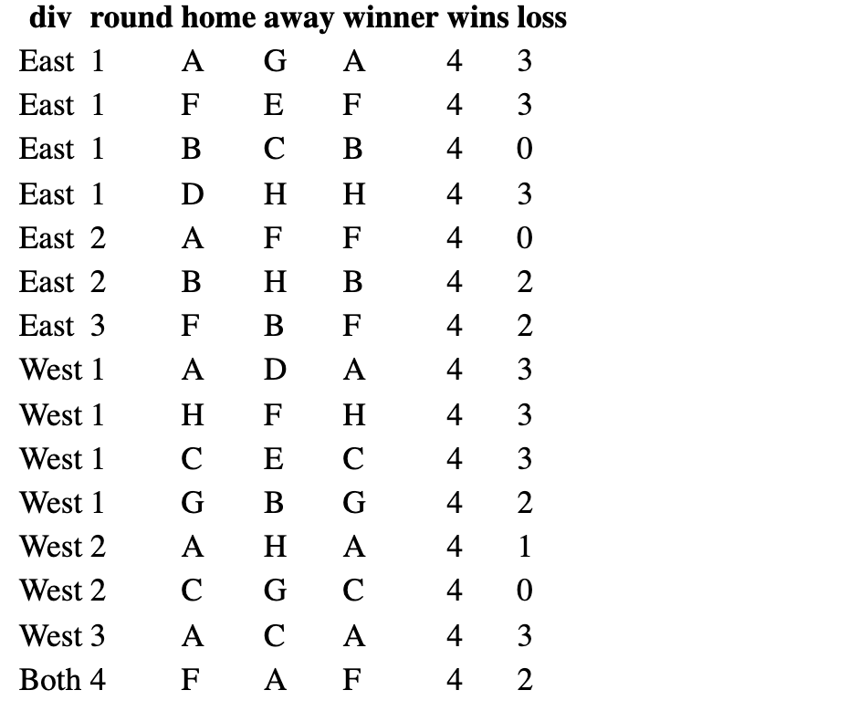

# Simulate the playoffs of a field hockey league using PHP

The purpose of this article is to describe a PHP application for simulating the playoffs of a field hockey league.

## The rules of the game

The following describes the settings of the league

- The league is composed of 2 divisions ("East" and "West").
- Each division has 8 teams ("A" to "H"), each with players 21.
- Each player has a random scoring probability ranging from 0.15 to 1.
- The winning probability of a team is the average of that its members
- During a match, the winning team is the one that has the highest winning probability

The rules of the playoffs are as followed:

- The 8 teams of a division are grouped by two (ex: A+B, C+D, E+F, G+H).
- Each group plays a series of games until one of the two teams gets 4 wins.
- The winners in this first round are again grouped in pairs (e.g. A+C, E+G).
- The last two processes are repeated until only one winner remains
- The last three processes are repeated for the second division.
- The winners from the two divisions then compete in a final round.

The simulation will return all the matches including the competing teams for each game, the winner, the number of wins, and losses. The following table provides an example, which will be different on each run (refresh)



If you do not have a PHP development environment, you want to use docker to create one quickly. The following shell command builds a minimal apache web server for PHP based on the 'php:7.2-apache' image. You can run the code directly from the command line or put it in a bash script.

``` bash
docker run -d -it \
    -v "$PWD":/var/www/html/:rw \
    --name hockeyApp --hostname hockeyApp \
    -w /var/www/html \
    -p 80:80 \
    php:7.2-apache
```


## Writing the application

We start by creating functions that simulate each process of the league. First, we need a function that simulates a team and the chance of its winning a game. The function needs no input, as the players are randomized. It returns only the winning rate of the team since the detailed information of the members has no other usage afterward.

``` php
function getWinProb(){
        # Simulate 21 players with 15 to 100 as frequency to score a goal
        # This makes the probability of scoring to range from 0.15 to 1
        # Return the proability to win for the team.
        for ($i=0; $i < 21; $i++) {$playerProb[] = mt_rand(15,100);}
        $teamProb = array_sum($playerProb) / count($playerProb);
        return($teamProb);
}
```

Next, we need to simulate a game within a group of two teams and decide the winner. As instructed the teams will play until one gets 4 wins.

``` php
function getgameRes($h,$a){
    # take teams as arguement, h for home and a for away
    # initialize scores for home and away team
    $hscore = 0;
    $ascore =0;
    while ($hscore < 4 & $ascore <4) {
        $wh = getWinProb();
        $wa = getWinProb();
        ($wh >= $wa) ? $hscore++ :$ascore++;
    }
    # build and return the winners info
    if ($hscore >= $ascore) {
        $gameRes = array('winner' => $h, 'wins' => $hscore, 'loss' => $ascore);
    }else {
        $gameRes = array('winner' => $a, 'wins' => $ascore, 'loss' => $hscore);
    }
    return $gameRes;
}
```

### Simulate the division playoff
The last process handles the rounds within a division order to select a single winner. The first round starts with the 8 teams grouped in pairs. Before pairing the teams, the list is shuffled to avoid having the same pairs each time. This is only necessary for the first round, as the pairs in the next round will depend on who wins in the last. The intra-division playoffs are simulated by the following function.

``` php
function getDivRes($div){
    # length of team must be greater than 2 and even
    $teams= range("A","H");
    shuffle($teams);
    $divRes = array();
    $round=0;
    # repeat round until one winner
    while (count($teams) >= 2) {
        # create group out of list of teams
        $groups = array_chunk($teams, 2);
        $teams = array();
        # play the game within in each group to get the winner
        foreach($groups as $group){
            $gameRes = getgameRes($group[0],$group[1]);
            $group = array("div"=>$div,"round"=>$round,"home" => $group[0],"away"=>$group[1]);
            $teams[]= $gameRes['winner'];
            $divRes[]= array_merge($group,$gameRes);
        }
        $round++;
    }
    return $divRes;
}
```

### Run the league
So far, we have created the functions that simulate the processes of the league. In the final step, we run all the playoffs of the league as followed

```php
# Run the round for each division Final game
$est=getDivRes("East");
$west=getDivRes("West");
# Run final game between the winners
$finalRes=getgameRes($est[6]['winner'],$west[6]['winner']);
# add division and round
$group = array("div"=>"Both","round"=>4,"home" => $est[6]['winner'],"away"=>$west[6]['winner']);
$finalRes= array_merge($group,$finalRes);
# merge result for east, west and final
$finalRes=array_merge($est,$west,array($finalRes));

```

Optionally we can preview the data structure of the league result with these lines

```php
#$res = getRoundRes($name)
echo "<pre>";
print_r($finalRes) ;
echo "</pre>";
```

### Display the result

Finally, we can display the result as an HTML table with the following

```php
$htmldata='<tr><th>div</th><th>round</th><th> home</th><th> away</th><th>winner</th><th>wins</th><th>loss</th></tr>';
# table content
foreach($finalRes as $data){
    $htmldata.='<tr><td>'.$data['div'].'</td><td>'.$data['round'].'</td><td>'.$data['home'].'</td><td>'.$data['away'].'</td><td>'.$data['winner'].'</td><td>'.$data['wins'].'</td><td>'.$data['loss'].'</td></tr>';
}
# show the table
echo '<table border=0 colspan=0>'.$htmldata.'</table>';
```

This completes our hockey league application. Although simple, this code can be adapted for a more advanced and real-world situation. The main change would be to have actual players with scoring records instead of randomizing the chances of scoring. Hope you've enjoyed this article.